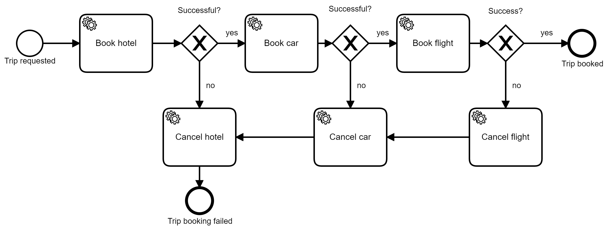

# Showcase to coordinate serverless functions using Zeebe in Camunda Cloud

This demo implements the classical trip booking Saga with a managed Zeebe cluster in Camunda Cloud.


I use this for certain talks:

* AWS Community Summit London 2019
* AWS Community Summit Live 2020 

# How-to use

This video gives a quick walk through the example:

<a href="http://www.youtube.com/watch?feature=player_embedded&v=RqOSwinvl-U" target="_blank"></a>

This is the BPMN workflow used:



## Deploy functions that will be orchestrated

* Deploy [lambdas](../../functions/aws) to book or cancel a car, hotel and flight

```
cd ../../functions/aws
serverless deploy 
```


## Create Zeebe cluster in Camunda Cloud

- Create Camunda Cloud account: https://camunda.com/products/cloud/
- Create Zeebe Cluster
- Retrieve client credentials (clusterId, clientId, clientSecret). We need that for deployment (via the Zeebe Modeler or `zbctl`) and the [serverless.yml](serverless.yml) that will set the right environment variables to be used in the [trip-zeebe/index.js](trip-zeebe/index.js) function.

## Deploy Workflow Definition to Zeebe

You can deploy directly via the modeler.

Or use the above credentials in that command:

```
zbctl --address 2daa1cac-f7cf-45e7-98f8-cccb474bf329.zeebe.camunda.io:443 --clientId KEFgrt9Azh07wTXbTX89sIBPgwgvzGaH --clientSecret vRfUxMcwuqYg4om6HYweR8iJdZyBl89BS9a5Bi4W7nOV5ezcvfOz4N4uO2vKAyWx deploy trip-booking.bpmn
```

## Run Lambda Worker

Make sure you operate the Lambda Worker as connection between Zeebe and AWS. Details can be found here: https://github.com/zeebe-io/zeebe-lambda-worker

For example just run it using Docker:
```
docker run --env-file camunda.env --env-file aws.env -p 8080:8080 camunda/zeebe-lambda-worker:SNAPSHOT
```
with camunda.env:
```
ZEEBE_CLIENT_CLOUD_CLUSTERID=x
ZEEBE_CLIENT_CLOUD_CLIENTID=y
ZEEBE_CLIENT_CLOUD_CLIENTSECRET=z
```
and aws.env:
```
AWS_REGION=eu-central-1
AWS_ACCESSKEY=x
AWS_SECRET=y
```

You might operate the container via AWS Fargate.


## Deploy trip booking function

* Adjust Zeebe client credentials in [serverless.yml](serverless.yml)
* Deploy coordinator function `trip booking`, this will call Zeebe to create a new workflow instance. Make sure you include all necessary node libraries to be deployed alongside:

```
cd libs/node-js
npm install --save zeebe-node
cd ../..
serverless deploy 
```

* Capture URL for this function from the log output

## Call trip booking via REST:

```
curl -H "Content-Type: application/json" -X PUT -d  @request-zeebe.json https://8rbjxgtf82.execute-api.eu-central-1.amazonaws.com/dev/trip/book
```

Now you can inspect your workflow instance via Operate.