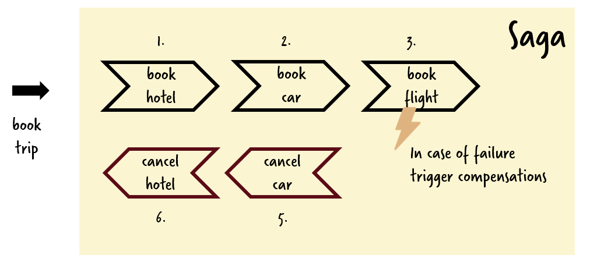

# Showcase to coordinate serverless Google functions using Zeebe in Camunda Cloud

This demo implements the classical trip booking Saga with a managed Zeebe cluster in Camunda Cloud and GCP Functions.



I used this or this talks:

* [Serverless Conference London 2019](https://serverlesscomputing.london/sessions/coordination-of-serverless-functions/): https://www.slideshare.net/BerndRuecker/serverless-london-2019-coordination-of-serverless-functions

# How-to use

This video gives a quick walk through the example:

<a href="http://www.youtube.com/watch?feature=player_embedded&v=M0tmV9fCq2U" target="_blank"></a>

## Create Zeebe cluster in Camunda Cloud

- Create Camunda Cloud account: https://camunda.com/products/cloud/
- Create Zeebe Cluster
- Retrieve client credentials (clusterId, clientId, clientSecret). We need that for `zbctl` and the [trip-zeebe/index.js](trip-zeebe/index.js) function

## Deploy Workflow Definition to Zeebe

Use the above credentials in that command:

```
zbctl --address 2daa1cac-f7cf-45e7-98f8-cccb474bf329.zeebe.camunda.io:443 --clientId KEFgrt9Azh07wTXbTX89sIBPgwgvzGaH --clientSecret vRfUxMcwuqYg4om6HYweR8iJdZyBl89BS9a5Bi4W7nOV5ezcvfOz4N4uO2vKAyWx deploy trip-booking.bpmn
```

## Deploy Serverless Stuff

* Deploy [functions as described](../../functions/gcp/):

```
cd ../../functions/gcp
serverless deploy 
```

* Capture the `google-function-base-url` from the console
* Add them as worker variable via the Camunda Cloud console, e.g:
  * google-function-base-url: https://us-central1-camunda-consulting-de.cloudfunctions.net

* Adjust Zeebe client credentials in [index.js](index.js)
* Deploy coordinator function (trip booking, it will call Zeebe):

```
serverless deploy 
```

* Capture URL for this function and call it via REST:

```
curl -H "Content-Type: application/json" -X PUT -d  @request-zeebe.json https://us-central1-camunda-consulting-de.cloudfunctions.net/bookTrip
```
